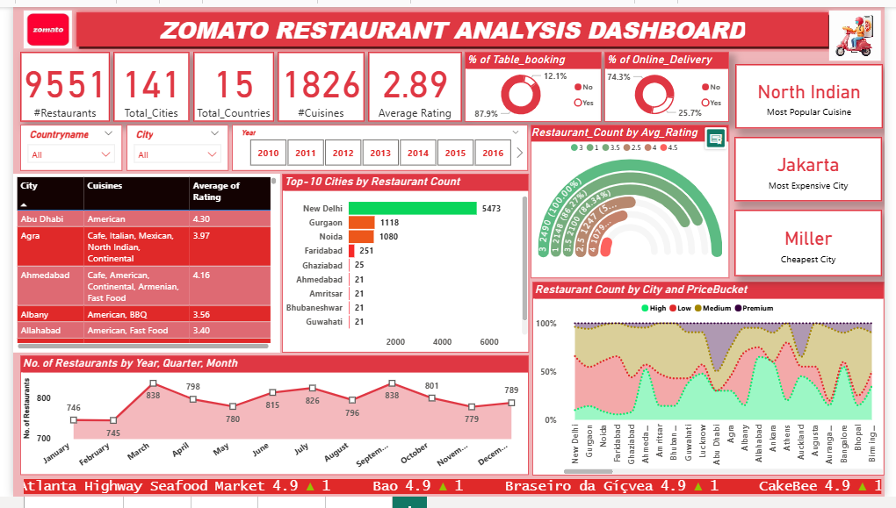
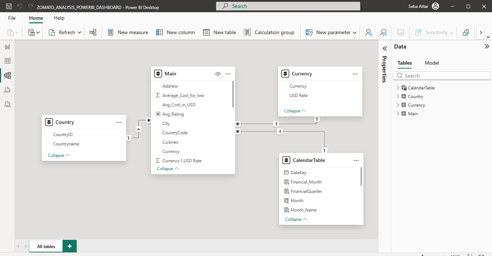

# 📊 Zomato Restaurant Data Analysis

---

## 🔎 Project Overview

This project analyzes **9500+ restaurants** from the Zomato dataset to uncover business insights related to restaurant growth, pricing trends, rating distribution, and online delivery adoption.

The objective was to transform raw data into meaningful business insights using SQL, Excel, Power BI, and Tableau.

---

## Project Context

This project was completed as part of the Data Analytics internship program where the objective was to perform end-to-end data analysis and create business insights using SQL, Excel, Power BI, and Tableau.

---

## 🛠 Tools & Technologies Used

- SQL (Data extraction & aggregation)
- Microsoft Excel (Data cleaning & preprocessing)
- Power BI (Dashboard development & DAX modeling)
- Tableau (Visual analytics & storytelling)

---

## 📂 Dataset Description

The dataset includes:

- Restaurant Name
- Country
- City
- Rating
- Votes
- Currency
- Average Cost for Two
- Online Delivery Availability
- Opening Date

Dataset Size:
- Total Records: 9551
- Total Columns: 21

---
## Dataset Source

The dataset used in this project was provided as part of the Data Analytics internship program conducted by ExcelR / AI Variant.

It contains restaurant-related information such as location, ratings, pricing, cuisines, and delivery availability.

Note: This dataset was provided for educational and analytical purposes as part of the internship project.

--- 
## ❓ Business Questions

The analysis focuses on answering the following key business questions:

- Which countries have the highest number of restaurants?
- How has restaurant growth changed over time?
- What percentage of restaurants offer online delivery?
- What rating range contains the majority of restaurants?
- Which cities have the highest concentration of restaurants?
- How does pricing vary across countries?

---

## 🧹 Data Cleaning Process (Excel)

- Removed duplicate records
- Handled missing/null values
- Standardized date formats
- Converted multiple currencies into USD
- Created structured calendar columns (Year, Quarter, Month)

---

## 🗃 SQL Analysis Performed

Key queries performed:

- Restaurant count by Year, Quarter, Month
- Country-wise restaurant distribution
- Average rating by country
- Online delivery trend analysis
- Aggregation using GROUP BY and JOIN

### Sample SQL Query

```sql
SELECT 
    cal.Year,
    cal.Quarter,
    cal.MonthFullName AS Month_Name,
    COUNT(*) AS Number_of_Restaurants
FROM main m
JOIN calendar cal
    ON cal.Datekey_Opening = m.Datekey
GROUP BY cal.Year, cal.Quarter, cal.MonthFullName
ORDER BY cal.Year, cal.Quarter;
```

---

## 🧩 Data Model

The data model was structured using:

- Fact Table: (Main) Restaurant Data
- Dimension Tables:
  - Calendar Table
  - Country Table
  - Currency Table

## Relationships

| Dimension Table | Column | Fact Table | Column | Relationship |
|----------------|--------|------------|--------|--------------|
| Calendar | DateKey | Main | DateKey | 1 : Many |
| Country | CountryID | Main | CountryCode | 1 : Many |
| Currency | Currency | Main | Currency | 1 : Many |

This structure enabled efficient time-based and country-level analysis.

---

## 📊 DAX Measures Used

Some important DAX calculations:

### Total Restaurants
```DAX
Total Restaurants = COUNT('Restaurants'[RestaurantID])
```

### Average Rating
```DAX
Average Rating = AVERAGE('Restaurants'[Rating])
```

### Online Delivery Count
```DAX
Online Delivery Count = 
CALCULATE(
    COUNT('Restaurants'[RestaurantID]),
    'Restaurants'[Has_Online_Delivery] = "Yes"
)
```

### Year-over-Year Growth
```DAX
YoY Growth = 
CALCULATE(
    [Total Restaurants],
    SAMEPERIODLASTYEAR('Calendar'[Date])
)
```

---

## 📊 Power BI Dashboard Features

- KPI Cards (Total Restaurants, Avg Rating)
- Year-wise Restaurant Growth
- Country-wise Distribution Map
- Rating Distribution Analysis
- Online Delivery Comparison
- Interactive Filters & Slicers

---

## 📈 Tableau Dashboard Features

- Dynamic country and city filters
- Time-series growth analysis
- Rating heatmap visualization
- Cross-country price comparison
- Interactive drill-down functionality

---

## 📷 Dashboard Preview

### 🔵 Power BI Dashboard



### Data Model Diagram



### 🟠 Tableau Dashboard


### 🔵 Excel Dashboard


---

## 📈 Key Business Insights

- India has the highest restaurant concentration.
- Most restaurants have ratings between 3.5 – 4.2.
- Online delivery adoption increased significantly after 2015.
- Currency normalization enabled fair cross-country comparison.
- Urban cities show higher restaurant density and rating averages.

---

## ⚠ Challenges Faced

- Handling inconsistent currency formats.
- Managing missing rating values.
- Creating accurate time-based analysis due to date inconsistencies.
- Ensuring correct relationships in data modeling.
- Optimizing DAX measures for performance.

---

## 🚀 Future Improvements

- Implement rolling average analysis.
- Add customer sentiment analysis.
- Build predictive model for rating trends.
- Deploy dashboard to Power BI Service.
- Automate data refresh using scheduled pipelines.

---

## 🎯 Skills Demonstrated

- Data Cleaning & Transformation
- SQL Joins & Aggregations
- Data Modeling
- DAX Calculations
- Tableau Visualization
- Business Insight Generation
- Dashboard Design
- Data Storytelling

---

## 📌 Business Impact

This project helps stakeholders:

- Understand market expansion trends
- Compare country-level performance
- Analyze pricing patterns
- Evaluate online delivery penetration
- Identify high-performing regions

---

## Project Structure

zomato-restaurant-data-analysis
│
├── ZOMATO_PROJECT_INSIGHTS.sql
├── ZOMATO_ANALYSIS_EXCEL.xlsx
├── ZOMATO_ANALYSIS_POWERBI.pbix
├── TABLEAU_ZOMATO_DASHBOARD.twbx
├── POWERBI_ZOMATO_DASHBOARD.png
├── TABLEAU_ZOMATO_DASHBOARD.png
├── ZOMATO_ANALYSIS_EXCEL_DASHBOARD.png
└── README.md

## 👩‍💻 Author

Saba Attar  
Aspiring Data Analyst 
- Skills : SQL | Power BI | Tableau | Excel

---
